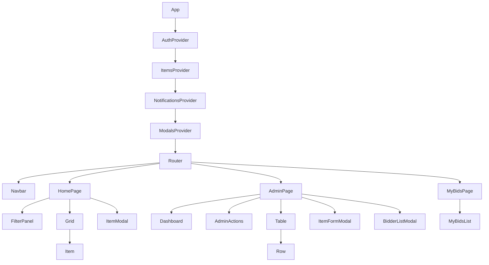
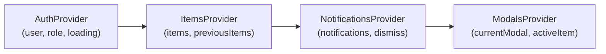

# Design Document: Admin & User Enhancements

## Overview

This design covers 10 enhancements to the Goostrey PTA Ball Auction application, spanning admin tooling (bidder list modal, role-based permissions, item CRUD, auction time management, dashboard, CSV export) and user-facing features (My Bids page, outbid notifications, search/filter). The architecture remains a React 18 SPA with Firebase backend, extending the existing context-based state management pattern.

### Key Design Decisions

1. **Role field migration**: Replace the boolean `admin` field with a string `role` field ("admin", "editor", "") in user documents. The AuthProvider will treat any truthy legacy `admin` value as role "admin" for backward compatibility.
2. **Client-side filtering**: Search/filter operates on the already-loaded items array from `onSnapshot` — no additional Firestore queries needed since all data is in a single document.
3. **Outbid detection**: Computed by comparing previous and current snapshot states within ItemsProvider, then dispatched via a new NotificationsProvider context.
4. **CSV generation**: Pure client-side using the items already in memory — no server-side endpoint required.
5. **New pages**: Add `/my-bids` route (authenticated users) and keep admin features on the existing `/admin` route with role-gated UI sections.

## Architecture

### High-Level Component Tree



### Route Structure

| Path | Component | Access |
|------|-----------|--------|
| `/` | HomePage | Public |
| `/admin` | AdminPage | role = "admin" or "editor" |
| `/my-bids` | MyBidsPage | Authenticated users |

### Context Architecture



## Components and Interfaces

### New Components

| Component | Location | Purpose |
|-----------|----------|---------|
| `FilterPanel` | `src/components/FilterPanel.jsx` | Search text input, status dropdown, price range, ending-soon toggle |
| `Dashboard` | `src/components/Dashboard.jsx` | Aggregate stats panel (total items, active, ended, bids, revenue) |
| `BidderListModal` | `src/components/BidderListModal.jsx` | Modal showing all bidders for an item |
| `ItemFormModal` | `src/components/ItemFormModal.jsx` | Add/Edit item form modal |
| `MyBidsList` | `src/components/MyBidsList.jsx` | List of user's bids with standing |
| `ToastNotification` | `src/components/ToastNotification.jsx` | Bootstrap toast for outbid alerts |
| `NotificationsProvider` | `src/contexts/NotificationsProvider.jsx` | Manages outbid notification state |

### Modified Components

| Component | Changes |
|-----------|---------|
| `AuthProvider` | Expose `role` string instead of boolean `admin`; backward-compat migration |
| `ItemsProvider` | Track previous items snapshot for outbid detection |
| `App.jsx` | Add `/my-bids` route, update `ProtectedRoute` to accept role array |
| `Navbar` | Add "My Bids" link for authenticated users; show admin link for editors too |
| `Row.jsx` | Add clickable bid count, Extend/Close buttons, Edit button; conditionally hide Delete based on role |
| `Admin.jsx` | Add Dashboard, Add Item button, Export CSV button; hide Reset All for editors |
| `Grid.jsx` | Accept filtered items from FilterPanel |
| `Home.jsx` | Add FilterPanel above Grid |

### Key Interfaces

#### AuthProvider Context Value

```typescript
interface AuthContextValue {
  user: FirebaseUser | null;
  role: "admin" | "editor" | "";  // replaces boolean `admin`
  loading: boolean;
  signOutUser: () => Promise<void>;
}
```

#### NotificationsProvider Context Value

```typescript
interface Notification {
  id: string;
  itemTitle: string;
  newHighestBid: number;
  currency: string;
  timestamp: number;
}

interface NotificationsContextValue {
  notifications: Notification[];
  dismiss: (id: string) => void;
}
```

#### ItemForm Data

```typescript
interface ItemFormData {
  title: string;
  subtitle: string;
  detail: string;
  primaryImage: string;
  secondaryImage: string;
  endTime: string;        // ISO datetime string
  startingPrice: number;
  reservePrice: number | null;
  currency: string;
}
```

#### Filter State

```typescript
interface FilterState {
  searchText: string;
  status: "all" | "active" | "ended";
  priceMin: number | null;
  priceMax: number | null;
  endingSoon: boolean;
}
```

#### Dashboard Stats

```typescript
interface DashboardStats {
  totalItems: number;
  activeItems: number;
  endedItems: number;
  totalBids: number;
  revenue: number;  // sum of winning bids where reserve met
}
```

### Utility Functions (New)

| Function | File | Purpose |
|----------|------|---------|
| `computeDashboardStats(items)` | `src/utils/dashboardStats.js` | Pure function: items array → DashboardStats |
| `filterItems(items, filterState)` | `src/utils/filterItems.js` | Pure function: applies all filters to items array |
| `generateCSV(items, userLookup)` | `src/utils/exportCSV.js` | Pure function: items → CSV string |
| `validateItemForm(data)` | `src/utils/validation.js` | Pure function: validates ItemFormData |
| `detectOutbids(prevItems, currItems, userId)` | `src/utils/outbidDetection.js` | Pure function: compares snapshots, returns outbid notifications |
| `computeUserBids(items, userId)` | `src/utils/userBids.js` | Pure function: extracts user's bids with standing |

## Data Models

### Firestore User Document (`users/{uid}`)

**Current schema:**
```json
{
  "firstName": "Rob",
  "surname": "Brown",
  "name": "Rob Brown",
  "admin": true
}
```

**New schema:**
```json
{
  "firstName": "Rob",
  "surname": "Brown",
  "name": "Rob Brown",
  "email": "rob@example.com",
  "role": "admin"
}
```

Migration strategy: AuthProvider reads `role` first; if absent, falls back to `admin` field (truthy → "admin", falsy → "").

### Firestore Items Document (`auction/items`)

No structural changes to the flat field format. Existing pattern:
- `item00001_bid00000` → item metadata (title, subtitle, detail, amount, endTime, currency, reservePrice, primaryImage, secondaryImage)
- `item00001_bid00001` → `{ amount: 25, uid: "abc123" }`

The `endTime` field is a Firestore Timestamp. Extend/Close operations update this field directly.

### Item Object (In-Memory after unflatten)

```typescript
interface AuctionItem {
  id: number;
  title: string;
  subtitle: string;
  detail: string;
  primaryImage: string;
  secondaryImage: string;
  startingPrice: number;
  endTime: Date;
  currency: string;
  reservePrice: number | null;
  bids: Record<number, { amount: number; uid: string }>;
}
```

### CSV Export Row

```
Item Title, Winning Bid, Winner Name, Winner Email
"Golf Day for 4", 150.00, "John Smith", "john@example.com"
```

### Firestore Security Rules (Updated)

```
rules_version = '2';
service cloud.firestore {
  match /databases/{database}/documents {
    match /auction/items {
      allow read: if true;
      allow write: if request.auth != null;
    }
    match /users/{userId} {
      allow read: if request.auth != null;
      allow write: if request.auth != null && request.auth.uid == userId;
    }
  }
}
```

Key change: `users/{userId}` read rule broadened from `request.auth.uid == userId` to `request.auth != null` so that admins can look up winner names/emails for CSV export and bidder list display.


## Correctness Properties

*A property is a characteristic or behavior that should hold true across all valid executions of a system — essentially, a formal statement about what the system should do. Properties serve as the bridge between human-readable specifications and machine-verifiable correctness guarantees.*

### Property 1: Bidder list is sorted descending by bid amount

*For any* auction item with one or more bids, the bidder list produced by the sorting function SHALL return bids in strictly descending order by amount, and each entry SHALL contain the bidder name and bid amount.

**Validates: Requirements 1.2**

### Property 2: Role resolution from user document

*For any* Firestore user document containing either a `role` field (with values "admin", "editor", or "") or a legacy boolean `admin` field (or both), the role resolution function SHALL return "admin" if `role` is "admin" OR if `role` is absent and `admin` is truthy; "editor" if `role` is "editor"; and "" otherwise.

**Validates: Requirements 2.1, 2.7**

### Property 3: Item form validation

*For any* ItemFormData object, the validation function SHALL reject the submission if the title is empty/whitespace-only, the starting price is negative or non-numeric, or the end time is not in the future; and SHALL accept the submission if all three conditions are met. The validation result SHALL be deterministic for the same input.

**Validates: Requirements 3.2, 4.2**

### Property 4: Item edit preserves existing bids

*For any* auction item with existing bids, when computing the Firestore update for an item edit operation, the resulting updates object SHALL NOT contain any bid fields (bid > 0), and SHALL only modify the item metadata field (bid 0) with the new values while preserving the existing reservePrice.

**Validates: Requirements 4.3**

### Property 5: Extend time adds exact duration

*For any* valid end time (Date) and any extension duration in {5, 15, 30} minutes, the computed new end time SHALL equal the original end time plus exactly the selected duration in milliseconds.

**Validates: Requirements 5.2**

### Property 6: Dashboard statistics computation

*For any* array of auction items, `computeDashboardStats` SHALL return: totalItems equal to the array length; activeItems equal to the count of items whose endTime is in the future; endedItems equal to totalItems minus activeItems; totalBids equal to the sum of bid counts across all items; and revenue equal to the sum of the highest bid amount for each ended item where the highest bid meets or exceeds the reserve price (or the item has no reserve set).

**Validates: Requirements 6.1, 6.3**

### Property 7: CSV export contains only qualifying items with correct columns

*For any* array of auction items and a user lookup map, `generateCSV` SHALL produce output containing exactly one data row per ended item that has a winning bid meeting or exceeding the reserve price (or has no reserve and has bids), and each row SHALL contain the item title, winning bid amount, winner name, and winner email.

**Validates: Requirements 7.1, 7.2**

### Property 8: User bids computation with standing

*For any* array of auction items and a valid userId, `computeUserBids` SHALL return exactly the items where the userId appears in at least one bid entry. For each returned item, the user's highest bid SHALL equal the maximum amount among that user's bids, the current highest bid SHALL equal the maximum amount among all bids, and the standing SHALL be "Winning" if the user's highest bid equals the current highest bid, or "Outbid" otherwise.

**Validates: Requirements 8.1, 8.2, 8.3, 8.4**

### Property 9: Outbid detection

*For any* previous items state, current items state, and userId: if the user had the highest bid on an item in the previous state but no longer has the highest bid in the current state, `detectOutbids` SHALL return a notification for that item containing the item title and new highest bid amount. If the userId is null or the user had no bids in the previous state, the function SHALL return an empty array.

**Validates: Requirements 9.1, 9.2, 9.4**

### Property 10: Filter items applies combined filters as intersection

*For any* array of auction items and any FilterState (searchText, status, priceRange, endingSoon), `filterItems` SHALL return only items that satisfy ALL active filter conditions simultaneously: title or subtitle contains searchText (case-insensitive), item status matches the status filter, current price falls within the price range, and (if endingSoon is true) the item is active with less than 30 minutes remaining. An item appears in the result if and only if it passes every active filter.

**Validates: Requirements 10.2, 10.3, 10.4, 10.5, 10.6**

## Error Handling

### Network/Firestore Errors

| Operation | Error Handling |
|-----------|---------------|
| Item create/edit | Display error alert, preserve form data, re-enable submit button |
| Extend/Close time | Display error alert, leave endTime unchanged in UI (snapshot will confirm) |
| Delete item | Display error alert, item remains in table |
| CSV export (user lookup) | Skip rows where user data cannot be fetched; include item title with "Unknown" for name/email |

### Validation Errors

| Context | Behavior |
|---------|----------|
| Item form | Inline field-level errors below each invalid input; submit button disabled until all valid |
| Bid count click (no bids) | Show "No bids placed" message in modal body |
| CSV export (no qualifying items) | Show info alert "No results available for export" |

### Permission Errors

| Scenario | Behavior |
|----------|----------|
| Editor attempts restricted action | Show "Insufficient permissions" toast; action is not executed |
| Unauthenticated user navigates to `/my-bids` | Redirect to home page |
| Unauthenticated user navigates to `/admin` | Redirect to home page (existing behavior, extended to editors) |

### Notification Edge Cases

| Scenario | Behavior |
|----------|----------|
| Multiple outbids in single snapshot | Queue notifications, display sequentially with 5s each |
| User is outbid while on a different tab | Show notification when tab regains focus (notifications accumulate) |
| Notification dismissed manually | Remove from queue immediately |

## Testing Strategy

### Property-Based Tests (fast-check)

The project already uses `fast-check` with Vitest. Each correctness property maps to a dedicated property-based test file with minimum 100 iterations (200 preferred, matching existing convention).

| Property | Test File | Function Under Test |
|----------|-----------|-------------------|
| 1: Bidder list sorting | `src/utils/bidderList.property.test.js` | `sortBidders(bids)` |
| 2: Role resolution | `src/utils/roleResolution.property.test.js` | `resolveRole(userDoc)` |
| 3: Item form validation | `src/utils/validation.property.test.js` | `validateItemForm(data)` |
| 4: Edit preserves bids | `src/firebase/utils.property.test.js` (extend existing) | `computeEditUpdates(...)` |
| 5: Extend time | `src/utils/timeExtension.property.test.js` | `computeExtendedTime(endTime, minutes)` |
| 6: Dashboard stats | `src/utils/dashboardStats.property.test.js` | `computeDashboardStats(items)` |
| 7: CSV export | `src/utils/exportCSV.property.test.js` | `generateCSV(items, userLookup)` |
| 8: User bids | `src/utils/userBids.property.test.js` | `computeUserBids(items, userId)` |
| 9: Outbid detection | `src/utils/outbidDetection.property.test.js` | `detectOutbids(prev, curr, userId)` |
| 10: Filter items | `src/utils/filterItems.property.test.js` | `filterItems(items, filterState)` |

**Configuration:**
- Library: `fast-check` (already installed)
- Minimum iterations: 100 per property (use `{ numRuns: 200 }` to match existing tests)
- Tag format: `Feature: admin-user-enhancements, Property {N}: {title}`

### Unit Tests (Vitest + Testing Library)

| Area | Test Focus |
|------|-----------|
| BidderListModal | Renders bidder data, shows "no bids" message for empty |
| ItemFormModal | Form renders empty for add, pre-populated for edit; submit calls correct handler |
| Dashboard | Renders stats from context; updates on context change |
| Row (extended) | Extend/Close/Edit buttons render; click handlers fire with correct args |
| FilterPanel | Controls render; onChange callbacks fire with correct filter state |
| MyBidsList | Renders items with standing badges |
| ToastNotification | Renders notification content; auto-dismisses after 5s |
| Role-based UI | Admin sees all buttons; editor sees restricted set |

### Integration Tests

| Area | Test Focus |
|------|-----------|
| AuthProvider role loading | Mock Firestore, verify role exposed in context |
| Item create flow | Mock Firestore write, verify correct field key computed |
| CSV download trigger | Mock URL.createObjectURL, verify blob content and filename |
| Outbid notification flow | Update ItemsProvider context, verify notification appears |

### Test Execution

```bash
# Run all tests (single run, no watch)
npm test
# or explicitly:
vitest --run
```
