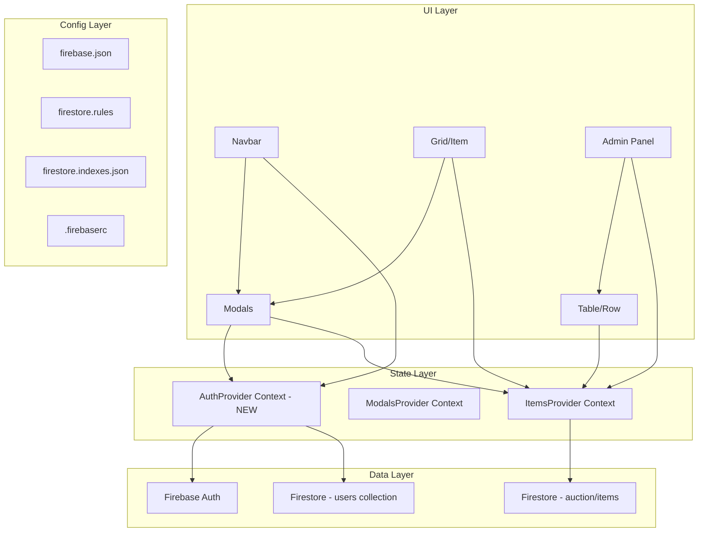

# Design Document: Auction Overhaul

## Overview

This design covers the overhaul of the Goostrey PTA Ball Auction application across four areas: enhanced user registration with first name and surname fields, a reserve price mechanism for auction items, version-controlled Firebase deployment configuration, and bid validation/authentication flow improvements.

The application is a React 18 + Vite SPA using Firebase Auth (with anonymous sign-in upgrade) and Firestore as the real-time database. It uses Bootstrap 5 for styling, React Router for navigation, and React Context for state management. The existing architecture stores all auction items in a single Firestore document (`auction/items`) with a flat key structure (`itemXXXXX_bidXXXXX`), and user profiles in a `users` collection keyed by UID.

### Design Goals

- Maintain the existing single-document Firestore pattern for items (real-time updates via `onSnapshot`)
- Add name fields to registration without breaking existing anonymous-to-registered upgrade flow
- Introduce reserve price as an optional field on item configuration
- Add Firebase deployment files to the repository for version-controlled infrastructure
- Improve bid validation robustness and authentication error handling

## Architecture

The overhaul preserves the existing layered architecture while extending it:



### Key Architectural Decisions

1. **New AuthProvider Context**: Extract authentication state from `AutoSignIn.jsx` into a dedicated `AuthProvider` context. This centralises user state (user object, admin flag, display name) and makes it accessible throughout the component tree without prop drilling.

2. **Reserve price stored in bid-0 field**: The reserve price is stored alongside item configuration in the `itemXXXXX_bid00000` field object. This avoids schema changes to the flat-key pattern and keeps all item data in the single document.

3. **Validation utilities extracted**: Bid validation and name validation logic is extracted into pure utility functions (`src/utils/validation.js`) for testability and reuse.

4. **Firebase config at project root**: `firebase.json`, `firestore.rules`, `firestore.indexes.json`, and `.firebaserc` live at the repository root following Firebase CLI conventions.

## Components and Interfaces

### New Components

| Component | Location | Responsibility |
|-----------|----------|----------------|
| `AuthProvider` | `src/contexts/AuthProvider.jsx` | Manages auth state, exposes user/admin/signOut via context |
| `ReservePriceInput` | `src/components/ReservePriceInput.jsx` | Admin input for setting reserve price per item |

### Modified Components

| Component | Changes |
|-----------|---------|
| `SignUpModal` (in `Modal.jsx`) | Add first name + surname fields, validation, store in Firestore user doc, set displayName to "FirstName Surname" |
| `Navbar` | Consume `AuthProvider` context, display first name only (split displayName on space), show Login/Sign up/Forgot Password when signed out |
| `ItemModal` (in `Modal.jsx`) | Enhanced bid validation, disable button during submission, better error messages, check for ended items |
| `Item` | Display "Sold" / "Reserve Not Met" / "Item Ended" status based on reserve price logic |
| `Table` / `Row` | Add reserve price column, display winning user's display name |
| `Admin` page | Add reserve price management, confirmation messages for Update/Reset operations, error handling for items.yml load failure |
| `ItemsProvider` | Parse reserve price from item data |
| `AutoSignIn` → replaced by `AuthProvider` | Full auth state management with error handling |

### Utility Modules

| Module | Location | Exports |
|--------|----------|---------|
| `validation.js` | `src/utils/validation.js` | `validateName(name)`, `validateBidAmount(amount, currentHighest, minIncrement)`, `validateReservePrice(value)`, `isWhitespaceOnly(str)` |
| `itemStatus.js` | `src/utils/itemStatus.js` | Extended: `itemStatus(item)` now returns `{ bids, amount, winner, reserveMet, status }` |
| `formatString.js` | `src/utils/formatString.js` | Unchanged exports, potentially add `extractFirstName(displayName)` |

### Interfaces

#### AuthProvider Context Value

```javascript
{
  user: FirebaseUser | null,       // Current Firebase user object
  admin: boolean,                  // Whether user has admin privileges
  loading: boolean,                // Auth state loading indicator
  signOutUser: () => Promise<void> // Sign out function with error handling
}
```

#### Validation Functions

```javascript
// Returns { valid: boolean, error: string }
validateName(name: string): ValidationResult
validateBidAmount(amount: string, currentHighest: number, minIncrement: number): ValidationResult
validateReservePrice(value: string): ValidationResult
isWhitespaceOnly(str: string): boolean
```

#### Extended Item Status

```javascript
// Returns auction status for an item
itemStatus(item: ItemObject): {
  bids: number,
  amount: number,
  winner: string,
  ended: boolean,
  status: 'active' | 'sold' | 'reserve-not-met' | 'ended-no-bids'
}
```

## Data Models

### Firestore Document: `auction/items`

The existing flat-key structure is preserved. Each item's configuration is stored at `itemXXXXX_bid00000`:

```javascript
// Item configuration (bid 0) - UPDATED with reservePrice
{
  "item00001_bid00000": {
    title: "Just Kidding",
    subtitle: "Voucher £20",
    detail: "...",
    primaryImage: "JustKidding",
    secondaryImage: "JustKidding",
    currency: "£",
    amount: 0,                    // starting price
    endTime: Timestamp,
    reservePrice: 15.00           // NEW - optional, null/undefined means no reserve
  },
  // Bids stored as subsequent keys
  "item00001_bid00001": {
    amount: 5.00,
    uid: "user-uid-123"
  },
  "item00001_bid00002": {
    amount: 10.00,
    uid: "user-uid-456"
  }
}
```

### Firestore Document: `users/{uid}`

```javascript
// User profile - UPDATED with firstName and surname
{
  firstName: "Jane",       // NEW - required, 2-50 chars, letters/hyphens/apostrophes
  surname: "Smith",        // NEW - required, 2-50 chars, letters/hyphens/apostrophes
  name: "Jane Smith",      // Display name (kept for backward compatibility)
  admin: ""                // Empty string = not admin, truthy = admin
}
```

### Firebase Auth User Profile

```javascript
{
  displayName: "Jane Smith",  // Set to "FirstName Surname" on registration
  email: "jane@example.com",
  uid: "auto-generated"
}
```

### Item Status Derivation Logic

```
IF item.endTime > now:
  status = "active"
ELSE IF no bids exist:
  IF reservePrice is set and > 0:
    status = "reserve-not-met"
  ELSE:
    status = "ended-no-bids"
ELSE IF reservePrice is set and > 0 AND highestBid < reservePrice:
  status = "reserve-not-met"
ELSE:
  status = "sold"
```

### Firebase Configuration Files

#### `firebase.json`
```json
{
  "firestore": {
    "rules": "firestore.rules",
    "indexes": "firestore.indexes.json"
  }
}
```

#### `.firebaserc`
```json
{
  "projects": {
    "default": "goostrey-ball-auction"
  }
}
```

#### `firestore.rules`
```
rules_version = '2';
service cloud.firestore {
  match /databases/{database}/documents {
    match /auction/items {
      allow read: if true;
      allow write: if request.auth != null;
    }
    match /users/{userId} {
      allow read: if request.auth != null && request.auth.uid == userId;
      allow write: if request.auth != null && request.auth.uid == userId;
    }
  }
}
```

#### `firestore.indexes.json`
```json
{
  "indexes": [],
  "fieldOverrides": []
}
```

## Correctness Properties

*A property is a characteristic or behavior that should hold true across all valid executions of a system — essentially, a formal statement about what the system should do. Properties serve as the bridge between human-readable specifications and machine-verifiable correctness guarantees.*

### Property 1: Whitespace-only names are rejected

*For any* string composed entirely of whitespace characters (including empty string, spaces, tabs, newlines), `validateName` SHALL return an invalid result with an appropriate error message.

**Validates: Requirements 1.2, 1.3**

### Property 2: Invalid names are rejected

*For any* string that is shorter than 2 characters OR contains characters other than letters (Unicode), hyphens, or apostrophes, `validateName` SHALL return an invalid result.

**Validates: Requirements 1.7**

### Property 3: Valid names are accepted

*For any* string of 2–50 characters composed only of letters, hyphens, and apostrophes (not starting/ending with hyphen or apostrophe), `validateName` SHALL return a valid result.

**Validates: Requirements 1.2, 1.3, 1.7**

### Property 4: First name extraction

*For any* display name string in the format "FirstName Surname" (where both parts are non-empty and separated by a space), `extractFirstName` SHALL return exactly the substring before the first space.

**Validates: Requirements 1.6**

### Property 5: Item status derivation

*For any* item with a defined endTime, startingPrice, optional reservePrice (≥0), and zero or more bids:
- If endTime is in the future → status is "active"
- If endTime is in the past AND no bids exist AND reservePrice > 0 → status is "reserve-not-met"
- If endTime is in the past AND highest bid < reservePrice (where reservePrice > 0) → status is "reserve-not-met"
- If endTime is in the past AND highest bid ≥ reservePrice (or no reserve set or reserve is 0) AND bids > 0 → status is "sold"

**Validates: Requirements 2.3, 2.4, 2.7, 5.4, 5.5, 5.6, 6.8**

### Property 6: Reserve price validation

*For any* numeric value in the range [0.00, 999999.99] with at most 2 decimal places, `validateReservePrice` SHALL accept it. *For any* value that is negative, exceeds 999999.99, has more than 2 decimal places, or is non-numeric, `validateReservePrice` SHALL reject it.

**Validates: Requirements 2.1, 6.5**

### Property 7: Bid amount validation

*For any* positive numeric string with at most 2 decimal places representing a value ≤ 999999.99 that is ≥ (currentHighest + minIncrement), `validateBidAmount` SHALL accept it. *For any* bid amount that is non-numeric, non-positive, has more than 2 decimal places, exceeds 999999.99, or is less than currentHighest + minIncrement, `validateBidAmount` SHALL reject it.

**Validates: Requirements 3.1, 3.2**

### Property 8: Countdown format correctness

*For any* positive millisecond duration, `formatTime` SHALL produce a string that:
1. Contains only the units d, h, m, s with numeric prefixes
2. Omits leading zero-value units (e.g., no "0d" prefix when days=0)
3. The numeric values, when converted back to milliseconds, equal the original duration (within 1 second tolerance due to rounding)

**Validates: Requirements 5.2**

### Property 9: Update operation preserves bids and reserve prices

*For any* Firestore items document containing bid entries and reserve prices, after running the update operation with new item configuration data, all existing bid entries (bid > 0) SHALL remain unchanged and all reservePrice values SHALL remain unchanged.

**Validates: Requirements 6.1**

### Property 10: Reset operation removes only bids

*For any* Firestore items document containing item configuration (bid 0) with reserve prices and bid entries (bid > 0), after running the reset operation, all bid entries SHALL be removed and all item configuration fields (including reservePrice) SHALL remain unchanged.

**Validates: Requirements 6.2**

## Error Handling

### Registration Errors

| Error Source | Handling |
|-------------|----------|
| Firebase Auth error (email in use, weak password, etc.) | Display Firebase error message verbatim in the form, preserve entered email |
| Name validation failure | Display inline validation error below the offending field, prevent submission |
| Network failure during registration | Display generic connection error, preserve all form data |

### Bidding Errors

| Error Source | Handling |
|-------------|----------|
| Not signed in | Display "You must be logged in to place a bid" |
| No display name (anonymous session) | Display message, redirect to Registration_Form after 1 second |
| Item ended | Display "Sorry, this item has ended!", close modal after 1 second |
| Bid too low | Display "You did not bid enough!" with minimum required amount |
| Invalid monetary format | Display "Please enter a valid monetary amount!" |
| Firestore write failure | Display generic error, re-enable submit button |

### Admin Errors

| Error Source | Handling |
|-------------|----------|
| items.yml fetch failure | Display "Configuration could not be loaded", leave existing data unchanged |
| Invalid reserve price input | Display validation error with accepted range, prevent submission |
| Firestore update failure | Display generic error message |

### Authentication Errors

| Error Source | Handling |
|-------------|----------|
| Login failure | Display Firebase error message, preserve email in form |
| Sign-out failure | Display "Sign-out was unsuccessful" error message |
| Password reset failure | Display Firebase error message |

## Testing Strategy

### Property-Based Tests (Vitest + fast-check)

The project will add `vitest` and `fast-check` as dev dependencies for property-based testing. Each property test runs a minimum of 100 iterations.

| Property | Module Under Test | Library |
|----------|------------------|---------|
| Properties 1–3 (name validation) | `src/utils/validation.js` | fast-check |
| Property 4 (first name extraction) | `src/utils/formatString.js` | fast-check |
| Property 5 (item status) | `src/utils/itemStatus.js` | fast-check |
| Property 6 (reserve price validation) | `src/utils/validation.js` | fast-check |
| Property 7 (bid amount validation) | `src/utils/validation.js` | fast-check |
| Property 8 (countdown format) | `src/utils/formatString.js` | fast-check |
| Properties 9–10 (update/reset) | `src/firebase/utils.jsx` (extracted pure logic) | fast-check |

Each test will be tagged with: `Feature: auction-overhaul, Property {number}: {title}`

### Unit Tests (Vitest)

- Registration form renders correct fields (1.1)
- Admin panel displays reserve price column (2.6, 6.3)
- Reserve price hidden from non-admin users (2.5)
- Bid rejection when item ended (3.3)
- Bid rejection when not signed in (3.4)
- Bid rejection when no display name (3.5)
- Submit button disabled during bid (3.6)
- Auto sign-in after registration (4.1)
- Anonymous user redirected to register (4.2)
- Firebase error displayed on registration failure (4.3)
- Firebase error displayed on login failure (4.4)
- Sign-out reverts navbar (4.5)
- Sign-out failure shows error (4.6)
- "Item Ended" displayed when countdown reaches zero (5.3)
- Confirmation message after Update/Reset (6.6)
- Error message when items.yml fails to load (6.7)

### Integration / Smoke Tests

- Firestore rules file exists and is valid syntax (7.1, 7.6)
- Firestore indexes file exists (7.2)
- firebase.json references correct files (7.3, 7.4)
- .firebaserc maps to goostrey-ball-auction (7.7)
- GitHub Actions workflow contains firebase deploy step (7.5)
- Real-time bid updates propagate via onSnapshot (5.1)
- Offline resilience — last data displayed when disconnected (5.7)

### Test Configuration

```json
{
  "devDependencies": {
    "vitest": "^1.x",
    "fast-check": "^3.x",
    "@testing-library/react": "^14.x",
    "@testing-library/jest-dom": "^6.x",
    "jsdom": "^24.x"
  }
}
```

Vitest config will be added to `vite.config.js`:
```javascript
export default defineConfig({
  plugins: [react()],
  base: '/goostrey-ball-auction/',
  test: {
    environment: 'jsdom',
    globals: true,
    setupFiles: './src/test/setup.js'
  }
})
```

