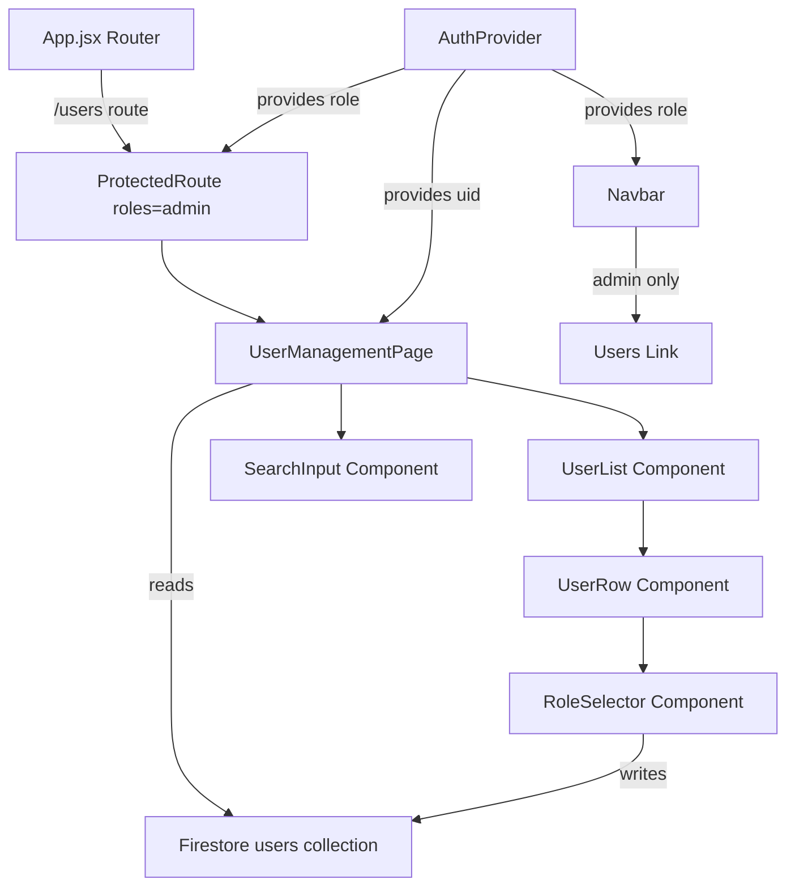

# Design Document: User Management

## Overview

The User Management feature adds an admin-only page to the Goostrey PTA Ball Auction app where administrators can view all registered users and manage their roles. The page integrates with the existing React/Vite/Firebase stack, reusing the `AuthProvider` context for role-based access control and Firestore for data persistence.

Key design decisions:
- **Admin-only access**: The existing `ProtectedRoute` component is extended to support admin-only routes (distinct from the admin+editor access used by the Admin page)
- **Client-side filtering**: All users are fetched once and filtered in-memory, since the user base is small (PTA event attendees)
- **Optimistic UI with rollback**: Role changes disable the selector during the write and revert on failure
- **Firestore rules enforcement**: Server-side rules prevent privilege escalation regardless of client behaviour

## Architecture



The feature follows the existing app architecture:
- A new page component at `src/pages/UserManagement.jsx`
- Utility functions in `src/utils/userManagement.js` for sorting, filtering, and display logic
- The existing `ProtectedRoute` in `App.jsx` already supports role arrays, so the route just needs `roles={["admin"]}`
- Firestore security rules are updated to enforce admin-only access to the users collection

## Components and Interfaces

### UserManagementPage (`src/pages/UserManagement.jsx`)

Top-level page component. Fetches all user documents from Firestore on mount, manages loading/error state, and orchestrates child components.

```jsx
// Props: none (uses useAuth() hook for current user context)
// State:
//   users: UserDoc[]        — all user documents
//   loading: boolean        — Firestore fetch in progress
//   error: string | null    — error message if fetch fails
//   searchText: string      — current search input value
//   statusMessage: { text: string, type: 'success' | 'danger' } | null
```

### UserList (inline within UserManagementPage)

Renders the filtered, sorted list of users as a Bootstrap table. Each row contains user details and a `RoleSelector`.

### RoleSelector (inline or extracted component)

A `<select>` element with three options: Admin, Editor, User. Disabled when:
- The row belongs to the currently signed-in admin (self-demotion prevention)
- A role update is in progress for that user

### SearchInput (inline)

A controlled text input that updates `searchText` state. Debouncing is not required since filtering is done in-memory on a small dataset (sub-millisecond).

### Utility Functions (`src/utils/userManagement.js`)

```js
/**
 * Sorts users alphabetically by surname, then firstName.
 * @param {UserDoc[]} users
 * @returns {UserDoc[]}
 */
export function sortUsers(users) { ... }

/**
 * Filters users by search text (case-insensitive substring match on firstName, surname, email).
 * @param {UserDoc[]} users
 * @param {string} searchText
 * @returns {UserDoc[]}
 */
export function filterUsers(users, searchText) { ... }

/**
 * Maps a role field value to its display label.
 * @param {"admin" | "editor" | ""} role
 * @returns {"Admin" | "Editor" | "User"}
 */
export function roleDisplayLabel(role) { ... }

/**
 * Formats the count string for filtered results.
 * @param {number} filtered
 * @param {number} total
 * @returns {string} e.g. "Showing 3 of 12 users"
 */
export function formatUserCount(filtered, total) { ... }
```

### Route Registration (`App.jsx`)

```jsx
<Route
  path={import.meta.env.BASE_URL + "users"}
  element={
    <ProtectedRoute roles={["admin"]}>
      <UserManagementPage />
    </ProtectedRoute>
  }
/>
```

### Navbar Update (`src/components/Navbar.jsx`)

Add a "Users" button visible only when `effectiveRole === "admin"`:

```jsx
{effectiveRole === "admin" && (
  <button onClick={handleUsers} className="btn btn-secondary me-2">
    Users
  </button>
)}
```

## Data Models

### Firestore User Document (`users/{uid}`)

```typescript
interface UserDoc {
  firstName: string;
  surname: string;
  name: string;       // display name (may be legacy)
  email: string;
  role: "admin" | "editor" | "";  // Role_Field
  admin?: boolean;    // legacy field, used by resolveRole() for backward compat
}
```

### Firestore Security Rules (updated)

```
rules_version = '2';
service cloud.firestore {
  match /databases/{database}/documents {
    match /auction/items {
      allow read: if true;
      allow write: if request.auth != null;
    }
    match /users/{userId} {
      // Any authenticated user can read their own document
      allow read: if request.auth != null && request.auth.uid == userId;
      
      // Admins can read any user document
      allow read: if request.auth != null
        && get(/databases/$(database)/documents/users/$(request.auth.uid)).data.role == "admin";
      
      // Users can write their own document IF they don't change the role field
      allow write: if request.auth != null
        && request.auth.uid == userId
        && (!request.resource.data.diff(resource.data).affectedKeys().hasAny(["role"]));
      
      // Admins can write any user document (including role changes)
      allow write: if request.auth != null
        && get(/databases/$(database)/documents/users/$(request.auth.uid)).data.role == "admin";
    }
  }
}
```

Key rule design decisions:
- Admin check uses `get()` to read the requester's own user document role field — this is the standard Firestore pattern for role-based access
- Self-write without role change is allowed so users can update their profile (name, email) without admin intervention
- The client-side self-demotion prevention (disabled selector) is backed by the fact that admins CAN technically change their own role via rules — the UI prevents it, but the rules don't need to enforce it since an admin writing their own role field is still an admin writing a role field

**Note on self-demotion**: Requirement 5.3 states Firestore rules SHALL deny self-role-change. To enforce this server-side, we add a specific deny for an admin changing their own role:

```
// Admins cannot change their own role field
allow write: if request.auth != null
  && request.auth.uid == userId
  && get(/databases/$(database)/documents/users/$(request.auth.uid)).data.role == "admin"
  && request.resource.data.diff(resource.data).affectedKeys().hasAny(["role"])
  ? false : ...
```

This will be implemented as a combined rule that checks: if the writer is the document owner AND is changing the role field, deny — even if they're an admin.

## Correctness Properties

*A property is a characteristic or behavior that should hold true across all valid executions of a system — essentially, a formal statement about what the system should do. Properties serve as the bridge between human-readable specifications and machine-verifiable correctness guarantees.*

### Property 1: User list sorting is correct

*For any* array of user objects with `surname` and `firstName` fields, `sortUsers(users)` SHALL return an array where each element's `surname` is lexicographically less than or equal to the next element's `surname`, and where surnames are equal, `firstName` is less than or equal to the next element's `firstName` (case-insensitive comparison).

**Validates: Requirements 2.1**

### Property 2: Role display label mapping

*For any* role value in the set `{"admin", "editor", ""}`, `roleDisplayLabel(role)` SHALL return `"Admin"`, `"Editor"`, or `"User"` respectively, and for any string not in that set, it SHALL return `"User"`.

**Validates: Requirements 2.2**

### Property 3: Search filter correctness

*For any* array of user objects and any search string, `filterUsers(users, searchText)` SHALL return only users where at least one of `firstName`, `surname`, or `email` contains `searchText` as a case-insensitive substring, and SHALL not exclude any user that matches.

**Validates: Requirements 3.2, 3.3**

### Property 4: User count formatting

*For any* non-negative integers `filtered` and `total` where `filtered <= total`, `formatUserCount(filtered, total)` SHALL return the string `"Showing {filtered} of {total} users"`.

**Validates: Requirements 3.5**

## Error Handling

| Scenario | Handling |
|----------|----------|
| Firestore fetch fails on page load | Display error alert: "Could not load users. Please try again." with a retry button |
| Role update write fails | Revert selector to previous value, show error toast for 5 seconds |
| User navigates to `/users` without admin role | `ProtectedRoute` redirects to home page |
| Auth state loading | Show spinner, don't render page content |
| Network timeout on role update | Same as write failure — Firestore SDK rejects the promise |

Error messages use Bootstrap alert components consistent with the existing `AdminPage` pattern (dismissible alerts with `alert-danger` class).

## Testing Strategy

### Unit Tests (example-based)

- **Access control**: Verify `ProtectedRoute` renders/redirects for admin, editor, regular, and unauthenticated users
- **Loading states**: Verify loading indicator shown during auth resolution and data fetch
- **Empty state**: Verify "no users found" message when collection is empty
- **Role selector**: Verify correct pre-selection, disabled state for current user, and label text
- **Navbar link**: Verify "Users" button visibility for admin vs editor vs regular user
- **Role update success/failure**: Verify selector disable/enable, success message, error rollback

### Property-Based Tests (universal properties)

Using `fast-check` (already in devDependencies). Each test runs minimum 100 iterations.

- **Property 1** — `sortUsers` ordering invariant
  - Tag: `Feature: user-management, Property 1: User list sorting is correct`
- **Property 2** — `roleDisplayLabel` mapping correctness
  - Tag: `Feature: user-management, Property 2: Role display label mapping`
- **Property 3** — `filterUsers` inclusion/exclusion correctness
  - Tag: `Feature: user-management, Property 3: Search filter correctness`
- **Property 4** — `formatUserCount` string format
  - Tag: `Feature: user-management, Property 4: User count formatting`

### Integration Tests

- **Firestore security rules**: Test with Firebase emulator to verify:
  - Admin can read all user docs (7.1)
  - Non-admin cannot read other user docs (7.2)
  - Any user can read own doc (7.3)
  - Admin can update role field (7.4)
  - Non-admin cannot update role field (7.5)
  - User can write own doc without role change (7.6)
  - Unauthenticated access denied (7.7)
  - Admin cannot change own role field (5.3)
